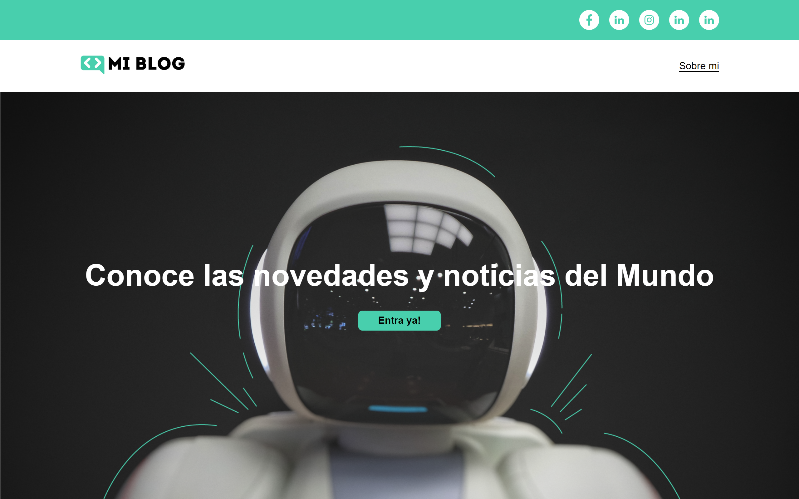

  

  

  
### Índice  

- [Descripción del proyecto](#Descripción-del-proyecto) 
- [Funcionalidades del proyecto](#Funcionalidades-del-proyecto)  
- [Acceso al proyecto](#Acceso-al-proyecto)  
- [Tecnologías utilizadas](#Tecnologías-utilizadas)  
- [Autores](#Autores)  
## Descripción del proyecto  

El proyecto BLOG fue parte del curso "Curso Práctico de Maquetación en CSS" de Platzi 

   
## Aspectos del proyecto 
- `Deseño 1:` Inicio
- `Deseño 2:`: Blog con la lista de las publicaciones 
- `Deseño 3:`: Publicación a detalle 
- `Deseño 4:`: Perfil 
## Acceso al proyecto
[Demo](https://zidjian.github.io/blog/)
## Tecnologías utilizadas
- Html
- SCSS
## Autores
| [ Waldir Maidana ](https://github.com/zidjian) |
| :---: |
